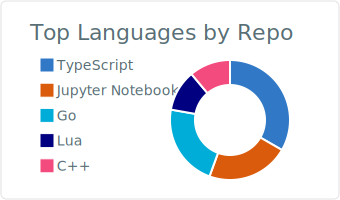
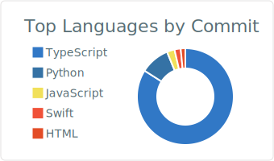
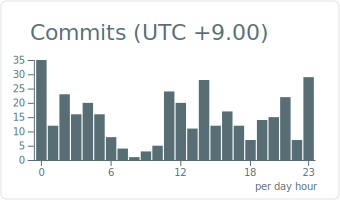

<h1>I'm YamadaMichel27</h1>

  <b>Hobbies:</b> Deep Work, Tech Event, Traveling (Domestic & Overseas), Music
   
  <b>Oshi:</b> Ado 🎧
   
  <b>Motto:</b> <i>Life does not have to be perfect to be wonderful</i>

 

<h2>📘 Internship Diary</h2>

  <a href="https://note.com/optfit/n/n0fe4946f4c54">
    2025/10 Internship Diary (OptFit)
  </a>

  

<!-- 🐍 Snake -->

  

 

<!-- 📈 Unified Section -->
<h2 align="center">📈 Coding Snapshot</h2>

<!-- 1段目：Languages -->

  

 

<!-- 2段目：Activity cards（白系） -->

  
  

  

<h2 align="center">🛠️ Tech Stack</h2>

<h3 align="center">💻 Language Skills</h3>

  

 

<h3 align="center">📚 Framework & Library Skills</h3>

  

 

<h3 align="center">🗄️ Database Skills</h3>

  

  
   
  RDS / DynamoDB

 

<h3 align="center">☁️ Infra & IaC Skills</h3>

  

 

<h3 align="center">🔧 Other Skills / Tools</h3>

  

 
